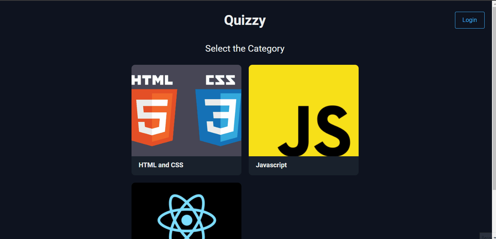

# Quizzy

Quizzy is simple MCQ based quiz app to test your programming knowledge.
[Live Link](https://quizzy-react-123.netlify.app/)

## Features

-   Authentication
    -   Signup
    -   Login/Logout
-   Filter quizzes by category
-   Rules page
-   Question page
-   Result page with total score and correct/incorrect answer highlighted

## Tech Stack

-   **Fontend: -**
    -   HTML
    -   CSS
    -   ReactJS
-   **Backend: -**
    -   Firebase

## Website Demo

## About Me

Hello, I am Parth Gabani, Learning front-end web development.

### Social Media

[Twitter](https://twitter.com/parthgabani2)

[LinkedIn](https://www.linkedin.com/in/parth-gabani-343b60141/)
